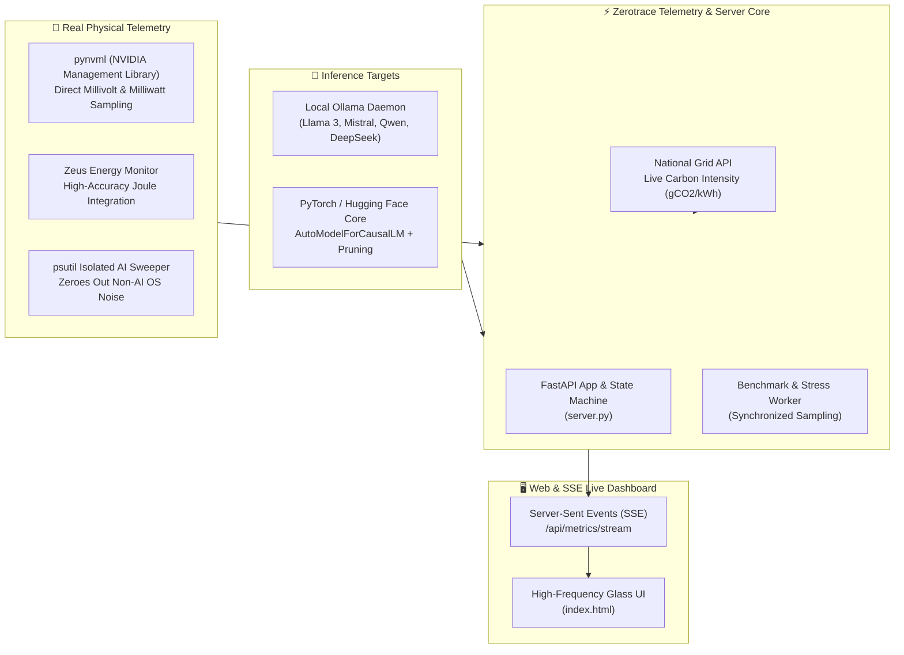

# ⚡ Zerotrace AI — Real-Time Hardware Telemetry & Green AI Profiler

[](https://fastapi.tiangolo.com/)
[](https://ollama.ai/)
[](https://developer.nvidia.com/)
[](https://ml.energy/zeus/)
[](https://github.com/Madhukumar511/ZEROTRACE-AI)
[](LICENSE)

> **Zero synthetic approximations. Real hardware telemetry. Real energy physics.**

Zerotrace AI is an open-source inference profiler and energy optimization engine for Large Language Models (LLMs). It captures high-frequency hardware metrics during active inference—measuring true **Joules drawn per token**, **GPU wattage**, and **carbon emissions ($gCO_2$)**—while offering live model optimization techniques to drastically slash computational power demand.

---

## 🏛️ System Architecture



---

## 🔬 Core Innovations & Engineering Highlights

### 1. Zero Synthetic Approximations
Most carbon calculators multiply token counts by an arbitrary flat constant. Zerotrace AI runs high-frequency concurrent threads sampling actual physical sensors:
- **NVIDIA NVML:** Direct register queries for device milliwatts (`nvmlDeviceGetPowerUsage`).
- **Zeus Monitor:** Sub-millisecond GPU energy integration windows.
- **Isolated AI CPU Sweeper:** Scans all system process trees for Ollama/Llama PIDs and isolates CPU usage strictly consumed by the AI model.

### 2. The 5 Live Energy Optimization Techniques
1. **Dynamic Token Limiting (`apply_token_limit`):** Clamps maximum output generation to suppress runaway repetitive generations.
2. **Context Window Trimming (`apply_context_reduction`):** Scales `num_ctx` and active attention matrix memory, drastically reducing KV-cache energy.
3. **Hardware-Aware Routing (`apply_gpu_routing`):** Dynamically toggles layer offloading between GPU VRAM and CPU threads for optimal energy efficiency.
4. **Quantization Spectrum Profiling (`get_quantization_variants`):** Compares bit-width trade-offs from 2-bit (`q2_K`) up to 8-bit (`q8_0`) with energy scale factors.
5. **Hardware Power Capping (`apply_gpu_power_cap`):** Programmatically sets hardware power management limits via NVML to cap maximum allowable GPU wattage.

### 3. Live Carbon Telemetry
Continuously syncs with the Carbon Intensity API to translate energy ($kWh$) into exact grams of $CO_2$ emitted:
$$\text{Emissions } (gCO_2) = \left( \frac{\text{Energy (Joules)}}{3,600,000} \right) \times \text{Carbon Intensity } (gCO_2 / kWh)$$

---

## 📂 Project Structure

```text
ZEROTRACE-AI/
├── server.py                   # High-performance FastAPI server & telemetry hub
├── index.html                  # Live real-time hardware telemetry dashboard
├── requirements.txt            # Python dependencies
├── .env.example                # Environment variables template
├── .gitignore                  # Git hygiene rules
├── .github/
│   └── workflows/
│       └── ci.yml              # Automated GitHub Actions test pipeline
└── tests/
    └── test_server.py          # Automated pytest suite (10/10 tests passing)
```

---

## 🚀 Quickstart Guide

### 1. Installation
```bash
git clone https://github.com/Madhukumar511/ZEROTRACE-AI.git
cd ZEROTRACE-AI

python3 -m venv venv
source venv/bin/activate
pip install -r requirements.txt
```

*(Optional: Install `torch`, `transformers`, `pynvml`, and `zeus-ml` for direct PyTorch and hardware GPU access).*

### 2. Run Automated Tests
```bash
python -m pytest tests/ -v
```

### 3. Start the Server
```bash
# Ensure Ollama is running if benchmarking local models:
# ollama serve

python server.py
```
Open **`http://localhost:8000`** in your browser to inspect the real-time hardware dashboard.

---

## 📡 API Reference

| Endpoint | Method | Description |
| :--- | :---: | :--- |
| `/` | `GET` | Serves the interactive telemetry dashboard |
| `/health` | `GET` | Subsystem status, Ollama detection, and live power readings |
| `/api/telemetry/live` | `GET` | High-frequency CPU, RAM, and GPU power snapshot |
| `/api/metrics/stream` | `GET` | Server-Sent Events (SSE) live telemetry data stream |
| `/api/ollama/models` | `GET` | Lists models available in local Ollama daemon |
| `/api/ollama/set-active` | `POST` | Sets active target model for benchmarking |
| `/api/benchmark` | `POST` | Executes real hardware benchmark and records baseline power |
| `/api/ollama/apply-optimization` | `POST` | Applies energy optimization profiles (token limit, context cut) |
| `/api/session` | `GET` | Returns 60-second rolling power averages and session state |
| `/emissions` | `GET` | Historical emissions and energy records |

---

## 📄 License
Distributed under the MIT License. See `LICENSE` for more information.
